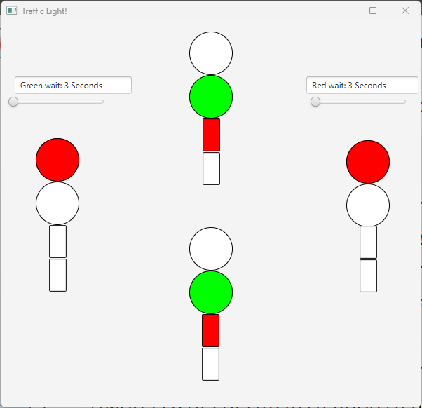

# Traffic Light
This is a JAVAFX application representing a traffic light, with two sets of traffic lights.      
Each with two components, car traffic light and pedestrians traffic light.          
**See example:**        
            
Using multithreading and the `wait` ability the application flips the traffic every agreed time (see scroll bars)           
          
A thread is running and flashes the current pedestrians traffic light every 500 milliseconds, 
by turning the light on and off     
     
The two scroll bars determine the wait time for each color (determined by the top and bottom lights)        
when a user scrolls the scrollbar the wait time changes:            
               
